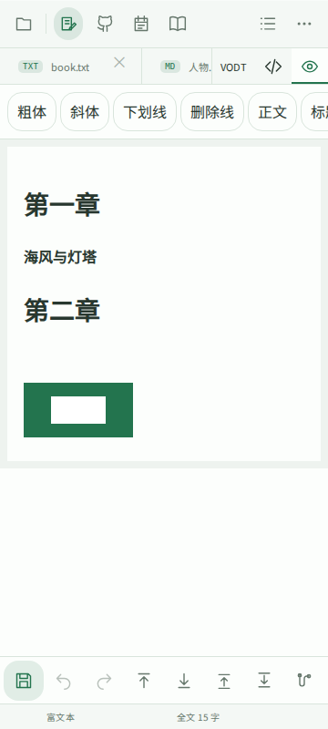
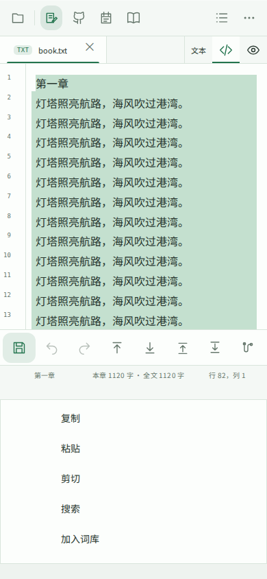

# 验证记录

后续修订：ODF 已改为可选组件，当前使用方法与支持范围以 [ODF-COMPONENT.md](ODF-COMPONENT.md) 为准；本文保留早期原型说明/验证记录。

日期：2026-10-10。以用户提供的 0.9.5 压缩包为基础。

- `npm test`：200 项单元测试通过，包含模板过滤、.vodt 别名识别、菜单放置、现有项目/原生服务回归。
- 现有 `tests/browser.mjs`：14 项界面检查通过。
- 新增 `tests/velaodt-browser.mjs`：390×844 鸿蒙界面、360×800 Android 界面、1280×850 Windows 界面均通过。
- 覆盖固定顶栏与底栏、手机底栏触摸拖拽、禁止根页面滚动、模拟键盘高度和偏移、扩展名模板过滤。
- 覆盖可见文字和超出编辑器渲染范围的长选区、菜单避让、独立菜单区域与安全边距、剪贴板复制。
- 覆盖富文本加粗、图片插入、修改图片宽度、保存重开、.vodt 与 .velaodt 同一编辑流程。
- 覆盖 ODT 打包与回读、图片字节及显示尺寸保持、纯文本不含图片 Base64、mimetype 首项未压缩且无附加头字段。
- 拒绝 XML DTD/实体、超出能力的 ODT 附件；导入外部文档不直接进入简化编辑模式。
- 使用 OASIS 官方 ODF 1.3 Relax NG 模式校验，导出的正文/表格 FODT、图片 FODT、ODT 的 content.xml、styles.xml 均通过。标准 FODT 导出移除应用专用 profile 属性。
- LibreOffice 实际成功将上述 FODT 打开并转换为 ODT，也成功打开本程序直接导出的带图 ODT 并转换回 FODT。
- `scripts/check-build.mjs`：三端版本、共享前端摘要与组件清单一致。

新 app.js 相比原包增加 42,142 字节；同样 gzip 压缩后的差值为 16,160 字节。这是本次布局、模板、选区菜单、图文原型等全部前端改动的增量，并非单个安装包增量。没有新增 npm 运行依赖或内置字体；交付包沿用原包的轻量构建配置，TeX 资源保留在 vendor 中，未重复内置进网页资源；PDF 资源仍保留，实际安装包大小需原生构建后测量。

## 尚未验证

本环境没有鸿蒙 SDK、Android SDK 或可运行 Windows Electron 的环境，未构建签名 HAP/APK/Windows 安装包，也未验证真机的系统选区手柄、输入法和菜单接管。三个平台配置下的 Chromium 浏览器测试不能替代这些检查。鸿蒙 READ_PASTEBOARD 的声明与用户授权流程已加入，发布权限配置还应按平台要求验证。

未声称支持任意复杂 ODT 无损编辑或精确办公排版。应优先用备份/副本试用富文本原型。

## 本地复现

```sh
npm ci
npm run build
npm test
npx playwright install chromium
npm run test:vodt
node scripts/check-build.mjs
```

若浏览器位于自定义路径，设置 `WENZHOU_CHROME`；截图用的 CJK 测试字体是当前测试环境临时配置，不打包到软件中。

## 样例与界面

`../examples/vodt/图文示例.vodt` 与 `图文示例.velaodt` 内容相同。另含标准 FODT/ODT 交换样例。




